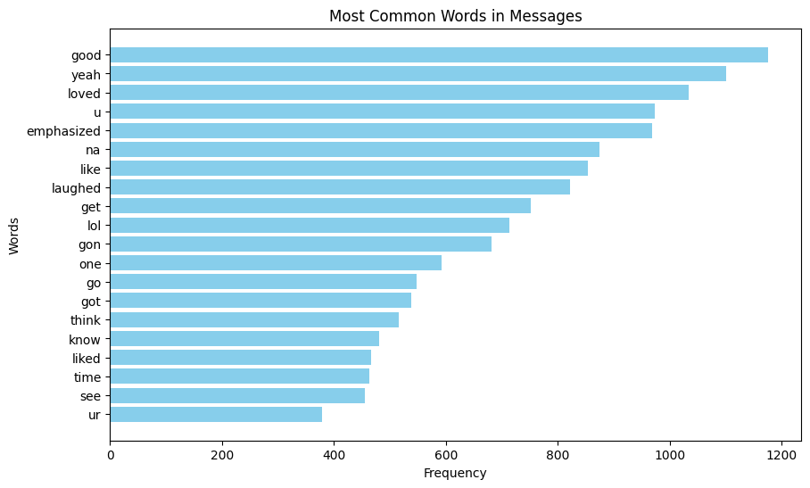

# chat-analysis-tool

This repository contains Python scripts for analyzing text messages from a conversation export. There are two main scripts:

- `Messaging_Patterns.py`: This script explores messaging patterns, including the histogram of messages sent per day and the average texts sent on each day of the week.

- `Language_Patterns.py`: This script focuses on language patterns, including word frequency analysis and sentiment trend analysis over time.

## Usage

To use these scripts, follow these steps:

1. **Prerequisites**: Ensure you have Python installed on your system.

2. **Clone the Repository**: Clone or download this repository to your local machine.

3. **Install Dependencies**: If you haven't already, install the required Python libraries (pandas, matplotlib, nltk (Natural Language Toolkit))

4. **Data Preparation**: Make sure you have your conversation export file named `conversation_export.txt` in the same directory as the Python scripts. The data should be structured with columns: `sender`, `message`, and `date`.

5. **Run the Scripts**:
- For messaging patterns analysis, run `Messaging_Patterns.py`.
- For language patterns analysis, run `Language_Patterns.py`.

6. **View Results**: The scripts will generate visualizations and analysis results as specified in the code.

## Screenshots

Explore my analysis results from a real text message conversations:

Feel free to explore and modify the scripts according to your needs!

